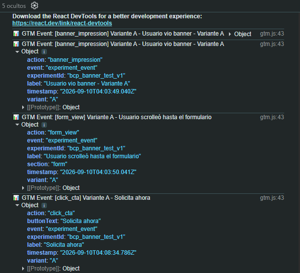

# Landing Page BCP - A/B Testing & Conversión

Proyecto frontend desarrollado en React diseñado para captar solicitudes de tarjetas de crédito, optimizando la conversión mediante experimentación A/B y seguimiento analítico avanzado con GTM.

## 🎯 Objetivo y Hipótesis del Experimento
* **Objetivo:** Aumentar el Click-Through Rate (CTR) hacia el formulario de captación.
* **Hipótesis (Equipo Growth):** "Modificar el color y mensaje del banner principal puede aumentar el porcentaje de clics (CTR) hacia el formulario de solicitud."
* **Variante A (Control):** Fondo azul corporativo con CTA "Solicita ahora" (Psicología: Confianza y autoridad).
* **Variante B (Challenger):** Fondo naranja vibrante con CTA "Aplica ya" (Psicología: Urgencia y dinamismo).

## ⚙️ Arquitectura Técnica
* **React + Vite:** Construcción modular de componentes (`Header`, `Banner`, `Benefits`, `Form`, `Footer`).
* **CSS Puro:** Estilos responsivos, variables globales y animaciones CSS (hover, transformaciones de escala) aislados por componente.
* **Gestión de Estado:** Uso de `useState` y `useEffect` para validación de formularios en tiempo real y asignación de variantes mediante `sessionStorage`.

## 📊 Implementación de Tracking (GTM)
El proyecto cuenta con un módulo centralizado (`utils/gtm.js`) que inyecta eventos personalizados al `window.dataLayer`.

**Eventos medidos:**
1. `banner_impression`: Visualización de la variante asignada.
2. `click_cta`: Interacción con el botón principal del banner.
3. `form_view`: El usuario scrollea y visualiza el formulario.
4. `form_submit`: Envío exitoso con validación de datos.

*(Captura aplicada del evento `window.dataLayer.push()` para GTM).*

## 🚀 Despliegue
* **GitHub Pages URL:** [https://juanerick14.github.io/reto-bcp/]
* **Repositorio:** Historial de commits detallado por cada etapa de maquetación, lógica y analítica.