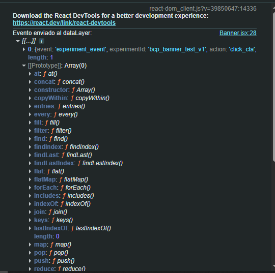

# BCP - Landing Experimental (A/B Test)

**Hipótesis del experimento:**
Modificar el color y mensaje del banner principal puede aumentar el porcentaje de clics (CTR) hacia el formulario de solicitud.

**Objetivo:**
Desarrollar una landing en React que muestre dos variantes del banner principal (A/B), registre eventos clave en Google Tag Manager (GTM) y documente el proceso técnico de implementación.

**Captura de implementación GTM:**
